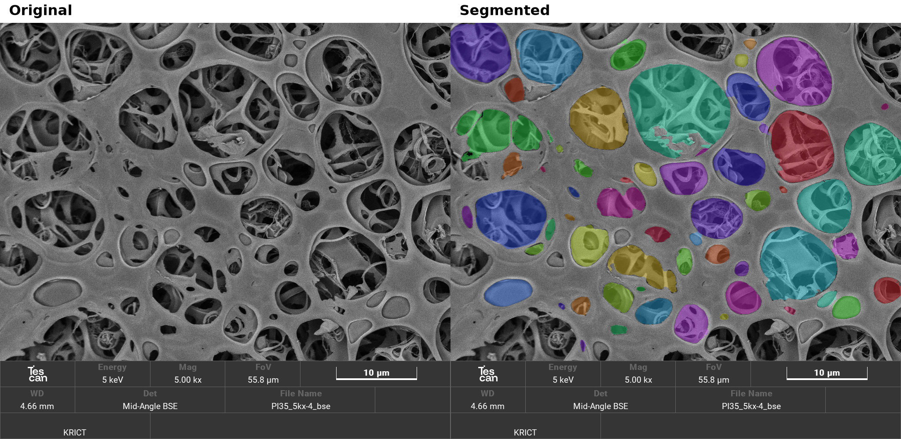

# PoreSAM

Original SEM (left) and segmented pores (right).

PoreSAM is a Windows app for analyzing pores in SEM images. Detect pores, edit the results, view measurements, and create a report.

## Features

- Automatic pore detection and manual editing
- Pore size, area, and shape measurements
- Histograms and scatter plots
- Image export and editable reports for one or multiple images
- PDF preview and PDF / HWPX export
- Feedback with text and image attachments

## Get started

1. Download the [Windows app](https://github.com/youngboong/PoreSAM/releases/latest).
2. Extract the ZIP file.
3. Open `PoreSAM/PoreSAM.exe`.
4. Load an image, then follow **Preprocess**, **Analyze & Edit**, and **Generate Report**.

No Python installation is required.

For building from source, see [DESKTOP.md](DESKTOP.md).
